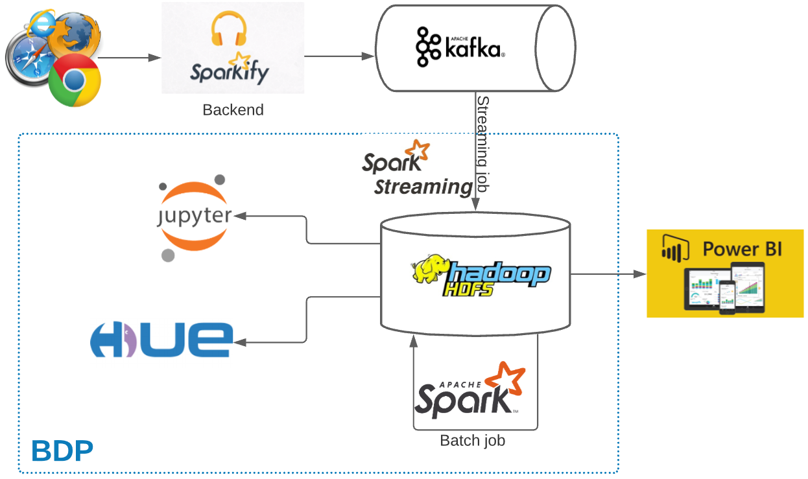

# Background
Spakify is a music streaming sevice as similar to Spotify. Every users' activities on Sparkify application are logged and sent to Kafka cluster. To improve the business, the data team will collect data to a Big Data Platform for further processing, analysing and extracting insights info for respective actions. 

To use this Sparkify, user needs to register an account with free or paid. As a registered user, they can upgrade/downgrade from free/paid to paid/free level. User can also leave the platform by cancelling account.

* The target data pipeline looks as below:

    <p align="left">
        
    </p>


* Business questions:
    1. Which gender is more active? 
    1. Which level is more active (free or paid)?
    1. Which factors (based on collected data) make users stop subcribe the service (churn)?

*Note*: To connect PowerBI to Hadoop (Impala specifically), refer [this guide](https://git.homecredit.net/Duc.NguyenV3/impala-odbc-setup).
<!-- <p align="left">
    
</p> -->

# Dataset
* Public dataset: [Million Song Dataset](http://millionsongdataset.com/)
* Contains 18 columns which has the information of customers(gender, name, etc.) and API events(login, playing next song, etc.)
* Experiment period: 2018–10–01 to 2018–12–01
* Kafka message example:
    ```json
    {
        "ts":1543621857000,
        "userId":"300011",
        "sessionId":500,
        "page":"NextSong",
        "auth":"Logged In",
        "method":"PUT",
        "status":200,
        "level":"paid",
        "itemInSession":37,
        "location":"New York-Newark-Jersey City, NY-NJ-PA",
        "userAgent":"Mozilla/5.0 (compatible; MSIE 9.0; Windows NT 6.1; WOW64; Trident/5.0)",
        "lastName":"House",
        "firstName":"Emilia",
        "registration":1538336771000,
        "gender":"F",
        "artist":"Olive",
        "song":"You\\'re Not Alone",
        "length":264.12363
    }
    ```

# BDP access
* Kafka brokers (C1): kafka01-vn00c1.vn.infra:9092, kafka02-vn00c1.vn.infra:9092, kafka03-vn00c1.vn.infra:9092
* Jupyter (PROD): https://bdp-edge01-pdc.vn.prod:8000/
* HUE (PROD): https://bdp-head01-pdc.vn.prod:8888/
* Spark history (PROD): https://bdp-utility01-pdc.vn.prod:18489/

# Quick commands
## Run Kafka producer
```bash
git clone git@git.homecredit.net:Duc.NguyenV3/bdp-demo.git
cd bdp-demo
python kafka_producer.py --time_interval 2
```

## Run Spark streaming
```bash
git clone git@git.homecredit.net:Duc.NguyenV3/bdp-demo.git
cd bdp-demo
./deploy.sh
```

## Clear topic
```
kafka-topics.sh --zookeeper zoo01-vn00c1.vn.infra:2181 --delete --topic streaming.itbi.demo.music_service
```

## Impala refresh table
```
impala-shell -i bdp-worker01-pdc.vn.prod -k --ssl -q "REFRESH bdp_ap_it.music_service_raw"
```

## Drop hive table
```
beeline -n 'hive' --verbose=true \
-u "jdbc:hive2://bdp-head01-pdc.vn.prod:10000/bdp_ap_it;principal=hive/_HOST@$BDP_KERBEROS_REALM;ssl=true;sslTrustStore=${BDP_TRUSTSTORE_PATH};trustStorePassword=${BDP_TRUSTSTORE_PASSWORD}" \
-e "drop table bdp_ap_it.music_service_raw"
```

# References
* Presentation link: [Open link](http://vnpdcett01.hcnet.vn/presentations/bdp/)
* Presentation file: [Open file](/presentation/Big Data Platform @HCVN.pdf)
* [Predicting music service churn with Apache Spark](https://medium.com/@angangli/predicting-churn-with-apache-spark-b9989008fc9a)
* [Sparkify User Churn Prediction](https://towardsdatascience.com/sparkify-user-churn-prediction-eff0868c5554)
